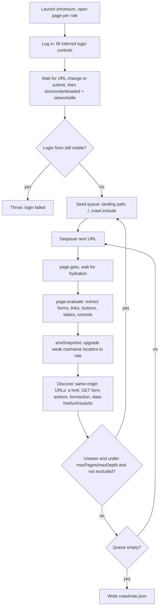
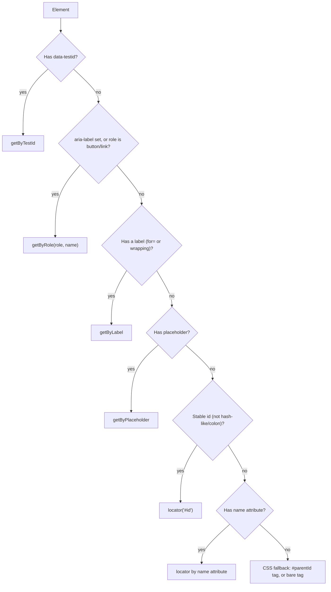
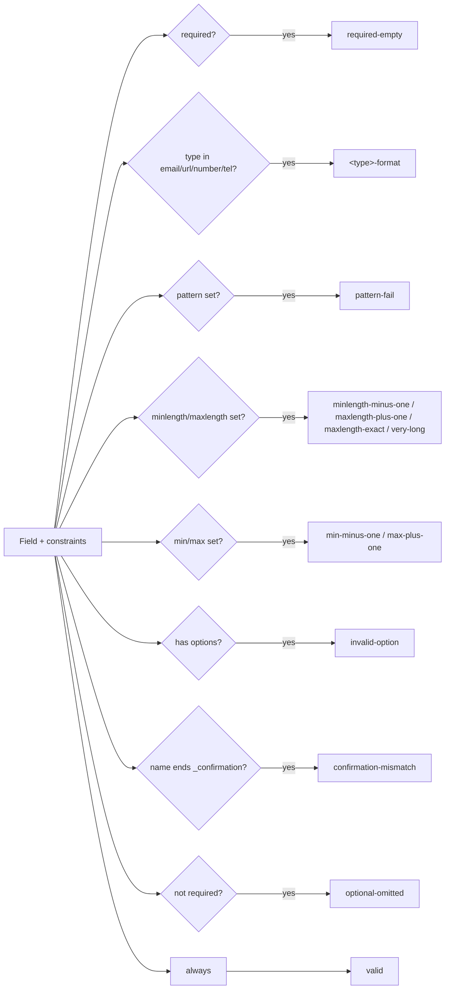

# TathyaTest (tt)

TathyaTest generates Playwright specs from a Playwright crawl of a web app. It crawls once per RBAC role,
extracts a normalized element model into `crawl/<role>.json`, maps that model against a dataset and
access matrix, and emits Playwright tests for positive, negative, and edge coverage.

## Layout

- `generator/`: TypeScript CLI, Playwright crawler, and test generator, exposed as `tt`.
- `case-study/todo-blade/`: Laravel Breeze Blade todo target.
- `case-study/todo-inertia-react/`: Laravel Breeze React/Inertia TypeScript todo target.
- `tathya.blade.config.example.yaml`: Blade case-study config reference.
- `tathya.inertia-react.config.example.yaml`: Inertia case-study config reference.
- `tathya.config.example.yaml`: canonical generic config reference.
- `tathya.saucedemo.config.yaml`: SauceDemo (external React SPA) evaluation subject.
- `tests/baseline-public/saucedemo/`: Three independent public Playwright suites (git submodules)
  used as the human-written baseline for `tt eval` EQ5. See `SOURCES.md` inside for attribution.
- `crawl/` and `tests/generated/`: runtime outputs, intentionally ignored by git.

## Setup

Use `make install` to build the generator CLI:

```bash
make install
```

That produces the compiled generator CLI at `generator/dist/` and a `tt` command in the active
Node/asdf bin path or your npm prefix/bin directory.

Use `make verify` to run the generator checks, then smoke the compiled `tt` entrypoint:

```bash
make verify
```

Use `make baseline-init` to initialise the public SauceDemo baseline submodules:

```bash
make baseline-init
```

Use `make uninstall` to remove the installed `tt` binary.

After install, you can run `tt` from any directory as long as the npm global bin directory is on
`PATH`.
If `tt` is managed by `asdf`, `make install` also refreshes the asdf-linked `tt` binary so the
shell resolves the latest build instead of an older shim target.

For manual development, you can still run the package-specific commands below.

```bash
cd generator
npm install
npm run build
npm link
```

For the Blade Laravel case study:

```bash
nix-shell case-study/todo-blade/shell.nix
cd case-study/todo-blade
composer install
cp .env.example .env
php artisan key:generate
touch database/database.sqlite
php artisan migrate:fresh --seed
php artisan serve
```

Use `tathya.blade.config.example.yaml` as `tathya.config.yaml` when testing this target.

For the React/Inertia case study:

```bash
nix-shell case-study/todo-inertia-react/shell.nix
cd case-study/todo-inertia-react
composer install
npm install
cp .env.example .env
php artisan key:generate
touch database/database.sqlite
php artisan migrate:fresh --seed
npm run build
php artisan serve --port=8001
```

Use `tathya.inertia-react.config.example.yaml` as `tathya.config.yaml` when testing this target.

Seeded credentials are `admin@example.com` / `password` and `user@example.com` / `password`.
The admin can reach `/admin/users`; the user receives a 403.

## SauceDemo evaluation subject

`tathya.saucedemo.config.yaml` targets `https://www.saucedemo.com` as a third evaluation subject —
a React SPA on a different tech stack to support a generalizability claim. The credentials
(`standard_user` / `secret_sauce`) are public. Because this is an external app with no control
plane, **SUT code coverage (Family B) and fault injection (Family C) do not apply**; `tt eval`
reports only model coverage (A), test-suite quality (D), and reliability/efficiency/baseline (E).

The human-written baseline for EQ5 comes from three independent public Playwright suites
(MIT-licensed, three different authors) stored as git submodules:

```bash
make baseline-init   # git submodule update --init --recursive
```

See `tests/baseline-public/saucedemo/SOURCES.md` for provenance, license, and pinned SHAs.

The baseline can be run standalone:

```bash
npx playwright test --config=tests/baseline-public/saucedemo/playwright.config.ts
```

## Commands

```bash
tt init
tt crawl
tt generate
tt run
tt all
tt eval
```

`tt crawl` uses the Playwright crawler for every target. It logs in once per configured role, starts
from the authenticated landing page, then follows same-origin URLs discovered from the live DOM.
Legacy configs that still contain `extractor.engine` are accepted, but the value is ignored.

`crawl.include` is optional explicit seeding for paths the crawler should visit in addition to
URLs discovered from the authenticated app DOM. Generic configs leave it empty; target-specific
case-study configs may include known routes such as `/todos` or `/admin`.

`tt generate` refreshes crawl outputs if they are missing or stale, then writes auth, forms,
interactions, and RBAC specs into `output.dir` using `output.language` (`ts` or `js`), plus a
`manifest.json` describing every generated test. Valid create/update fields are filled at runtime
from `@faker-js/faker` (seedable via `data.faker.seed`); the target field of a negative/edge case
stays a deterministic literal.

`tt eval` runs the metric-based evaluation and writes `metrics/report.{json,md}`: model coverage,
system-under-test code coverage (PCOV), fault-detection effectiveness (mutation score over a seeded
fault catalogue), test-suite quality, and reliability/efficiency with a hand-written baseline
comparison (`tests/manual/<stack>`). It reads `evaluation.stacks` to run the study across the Blade
and React/Inertia case studies. Requires the target servers running with `COVERAGE=1` for coverage,
and PCOV (`all.pcov` is in each `shell.nix`). Flags: `--stack`, `--repeat`, `--no-faults`,
`--no-coverage`, `--no-baseline`.

`tt init` asks for a project name, creates a slugged directory, and writes the config inside it:

```bash
tt init
cd my-test
tt crawl
tt generate
tt run
```

The wizard asks for URL/domain, then each credential role with its username and password before
prompting for another role, then asks for the generated Playwright language. Login
controls are inferred at crawl/test runtime. The generated specs are written to `tests/generated`
inside the project directory.

## How DOM extraction works

`tt crawl` extracts the DOM with a real Chromium browser (Playwright), not an HTML parser.
It launches `chromium.launch()`, opens one `page` per configured role with `baseURL` set,
logs in once, then follows same-origin links/forms discovered live from the rendered page.



**Login.** Login controls are inferred by scoring candidate inputs in the rendered HTML
(`generator/src/login.ts`): username (`type="email"` +100, `autocomplete="username"` +90,
`autocomplete="email"` +80, name/id/label matching `email|username|user|account|identifier|handle`
+50), password (`type="password"` +100, matching `password|passcode|pin` +50), submit
(`data-test`/`data-testid` present +100, is a `<button>` +20, text matching
`log in|login|sign in|sign-in` +50, `type="submit"` +10). The submit click is raced against
`page.waitForURL` (5s timeout) for a path change, then the crawler waits for
`domcontentloaded` and `networkidle` so client-rendered apps finish hydrating. If the
landing path is still the login path or `/`, it checks whether a password-like control
is still visible (`input[type="password"]`, `[autocomplete="current-password"]`,
`[name*="password"]`, `[id*="password"]`, `[placeholder*="Password"]`) and fails loudly
if so, rather than silently crawling a login page.

**Per-page extraction.** Everything below runs inside one `page.evaluate()` call per
visited page, reading the live DOM:

- **Forms** (`form`): resolved `action` (path + query), normalized `method`
  (`GET`/`POST`), `noValidate`, and a CRUD classification (see below). Fields come from
  `input, select, textarea`, excluding unnamed, hidden, submit, and button inputs; each
  field captures its `type`, `label`, `required` flag, constraint attributes
  (`minlength`, `maxlength`, `min`, `max`, `step`, `pattern`, `inputmode`, `accept`), and
  `<option>` values for selects. The submit control is
  `button[type="submit"], input[type="submit"]`, falling back to a typeless `<button>`.
- **Links** (`a[href]`), kept only when same-origin.
- **Buttons**, collected from three selector passes so no interactive control is missed:
  `button`; `input[type=button|submit|reset|image]`; and
  `[role=button|menuitem|tab]` elements that aren't already `<a>`/`<button>`/`<input>`.
- **Tables** (`table`): header text and `tbody tr` row count.
- **Orphan `<select>` controls** outside any `<form>` — these capture SPA sort/filter
  dropdowns that aren't part of a submittable form.
- Visibility for every element is computed with `checkVisibility()` (falling back to a
  bounding-rect + `visibility` check), so hidden duplicates (e.g. responsive nav clones)
  can be deduplicated later in `mapper.ts`.

**Accessibility enrichment.** After the raw extraction, the crawler takes a
`page.ariaSnapshot()` of the whole page and of each `<form>`, parses it, and upgrades any
element that only got a weak `css` or `name` locator up to a `role` locator — but it never
overrides a `testid`, `label`, or `placeholder` locator, since those already satisfy the
priority chain below.

**Discovering more URLs.** Same-origin URLs are harvested from `a[href]`; `form[action]`
only when the form's method is `GET` (a `page.goto` to a POST-only action would 405);
`formaction` on buttons/inputs, same GET-only rule; and an exact list of custom
attributes: `data-href`, `data-url`, `data-route`, `data-to`. New URLs are queued subject
to `crawl.maxPages`, `crawl.maxDepth` (counted by path segments), and `crawl.exclude`
prefix matches; `crawl.include` seeds extra paths the crawler should always visit. A
response that isn't ok and renders zero forms/links/controls is treated as an error page
and dropped rather than explored further.

## Keyword rules for test generation

Every classification below is an exact string/regex match in the generator source — not
a heuristic guess. Keywords are grouped by the file that owns them.

### 1. Locator priority chain

`generator/src/extract/rendered.ts` picks a locator per element at crawl time, in this
exact order (never positional/`nth-child`); `generator/src/locator.ts` turns the chosen
strategy into a Playwright call when emitting a spec:



A "stable" id rejects anything matching `/[0-9a-f]{8,}|:/` (hashed or framework-generated
ids such as React's `:r3:`). Accessible roles are inferred from the tag/type:
`button`→button, `textarea`→textbox, `select`→combobox, `a[href]`→link, and `<input>` by
`type`: `button|submit|reset|image`→button, `checkbox`→checkbox, `radio`→radio,
`number`→spinbutton, everything else→textbox. The aria-snapshot enrichment pass later
normalizes `searchbox` to `textbox` and only accepts
`textbox|button|link|checkbox|radio|combobox|spinbutton` as valid roles.

### 2. HTML constraint → test-variant rules

`generator/src/fieldgen.ts` turns captured field constraints into named variants. Each
row is one generated test case:

| Trigger | Variant name | Tier | Value | Expected outcome |
|---|---|---|---|---|
| always | `valid` | positive | a realistic value for the field's type | success |
| `required` (or `data.requiredFields`) | `required-empty` | negative | empty string | error |
| `type` is `email`, `url`, `number`, or `tel` | `<type>-format` | negative | a value of the wrong shape for that type | error |
| `pattern` attribute present | `pattern-fail` | negative | a string that violates the pattern | error |
| `minlength` set | `minlength-minus-one` | negative | one character short of the minimum | error |
| `maxlength` set | `maxlength-plus-one` | negative | one character past the maximum | error |
| `maxlength` set | `maxlength-exact` | edge | a format-valid value of exactly that length | success |
| `maxlength` set (or not, for text-like fields) | `very-long` | edge | ~10× the limit, or 10,000 chars with no limit | graceful (no 500) |
| `min` set | `min-minus-one` | negative | one below the minimum | error |
| `max` set | `max-plus-one` | negative | one above the maximum | error |
| text-like field | `unicode` | edge | mixed-script/emoji string | graceful |
| text-like field | `whitespace` | edge | the valid value padded with leading/trailing spaces | graceful |
| field has `<option>`s (select/radio) | `invalid-option` | negative | an option value that doesn't exist | error |
| field name listed in `data.unique`/`data.duplicates` | `duplicate` | negative | a value already taken | error |
| field name ends in `_confirmation` | `confirmation-mismatch` | negative | the valid value plus a suffix, so it disagrees with its source field | error |
| field is not `required` | `optional-omitted` | edge | field omitted entirely | graceful |

Supporting keyword lists:

- **Text-like types** (get `unicode`/`whitespace`/unlimited `very-long` variants):
  `text`, `search`, `email`, `url`, `tel`, `textarea`, `password`.
- **Confirmation detection**: a field name ending in `_confirmation` (set by the crawler
  when it sees that suffix) or listed in `data.confirmFields`; such fields skip all
  length/format variants and instead pair with their source field.
- **Natively unfalsifiable variants**: on a form without `novalidate`, the browser's own
  constraint validation blocks submission before JS runs, so `maxlength-plus-one`,
  `invalid-option`, and `confirmation-mismatch` are skipped — they'd never reach the
  server-side oracle.



### 3. CRUD-operation classification

`generator/src/extract/rendered.ts` reads a form's Laravel-style method-spoofing hidden
field to classify its CRUD operation — submit-button text is never used for this:

```
hidden input[name="_method"] = PUT or PATCH  -->  update
hidden input[name="_method"] = DELETE        -->  delete
no _method, form method = POST               -->  create
form method = GET                            -->  unknown
```

This feeds the mapper: update forms never get a `duplicate` negative variant (editing a
record to its own existing value isn't a real uniqueness violation), and a fieldless
delete form (just a `_method=DELETE` button) gets a dedicated `delete` positive case
instead of the generic `valid` label.

### 4. Pagination keywords

`generator/src/mapper.ts` classifies links/buttons as pagination controls by exact label
match (after lowercasing and stripping arrow decoration `«»‹›←→<>` when the label also
contains alphanumerics) or by query-parameter key:

| Action | Label regex |
|---|---|
| previous | `^(previous\|prev\|older\|‹\|«\|<\|←)$` |
| next | `^(next\|newer\|›\|»\|>\|→)$` |
| first | `^(first\|<<)$` |
| last | `^(last\|>>)$` |
| page | `^page\s+\d+$` or a bare `^\d+$` |

A link also counts as a pagination control if its query string contains any key matching
`^(page|p|pageNo|pageNum|pageNumber|offset|start|cursor|after|before|limit)$`. A
`page`/`p`/`pageNo`/`pageNum`/`pageNumber` key whose value is `1` is treated as the
default page and stripped before comparison, so a link pointing at `?page=1` collapses
with the unparameterized URL instead of generating a redundant case. Only one
representative control per action per page is kept, preferring a visible one over a
hidden responsive duplicate.

### 5. Field-name semantic keywords (for realistic fill values)

`generator/src/faker.ts` matches the field's `name` attribute against a prioritized list
of patterns to pick a meaningful `@faker-js/faker` expression — name-based intent wins
over the raw `type` attribute. Patterns, in priority order: `email`; `username`/`user`/
`login`; `url`/`website`/`homepage`/`link`; `slug`; `phone`/`tel`/`mobile`; `_at` suffix/
`date`/`deadline`/`birthday`; `price`/`amount`/`cost`/`total`/`salary`; `qty`/`quantity`/
`count`/`stock`/`age`/`year`; `firstname`/`first_name`/`fname`; `lastname`/`last_name`/
`lname`; `description`/`body`/`content`/`notes`/`message`/`comment`/`bio`/`summary`;
`title`/`subject`/`headline`/`label`; `name`/`_name` suffix/`fullname`; `company`/
`organization`/`organisation`; `city`; `country`; `zip`/`postcode`/`postal`; `address`/
`street`; `color`/`colour`. If no name pattern matches, the field's HTML `type` picks a
generic faker expression instead (`email`, `url`, `tel`, `number`, `range`, `date`,
`datetime-local`, `time`, `month`, `password`, `color`).

### 6. Other classification rules worth knowing

- A link or button is treated as a plain **interaction** test only if it isn't already
  classified as pagination and isn't a form's own submit control.
- Interaction links are deduplicated by route shape plus **sorted query keys** (values
  dropped) — so `/todos?status=done` and `/todos?status=pending` stay distinct test
  targets, but `/todos?status=done&sort=asc` and `/todos?sort=asc&status=done` collapse
  into one.
- The login negative-password test always uses the literal value
  `<configured-password>-wrong`.
- A confirmation field's value is emitted as a reference to its source field (so the spec
  echoes whatever the source field generated at runtime), not a literal.

## Coverage

`coverage` can be `positive`, `negative`, `edge`, or `all`.

- Positive: valid login, valid form submissions, authorized navigation.
- Negative: wrong password, required-empty, type/pattern/length/range failures, invalid options,
  duplicate configured unique fields, confirmation mismatch, RBAC blocked routes. Use
  `data.requiredFields` to force blank negatives for fields the crawl missed.
- Edge: exact boundaries, long values, unicode, whitespace, optional omissions.

Assertions check state instead of exact error messages. Server-side validation expects a visible
error indicator from `oracle.errorSelector`; native validation checks HTML validity state.

See [Keyword rules for test generation](#keyword-rules-for-test-generation) above for the
exact trigger that produces each negative/edge variant.

## Known Gaps

Custom Laravel validation rules, closure rules, FormRequest logic that is not visible in HTML,
security/injection testing, performance testing, and mobile/native apps are out of scope for this
prototype. Use `data.unique` and `data.confirmFields` for server-only hints the crawler cannot infer.
